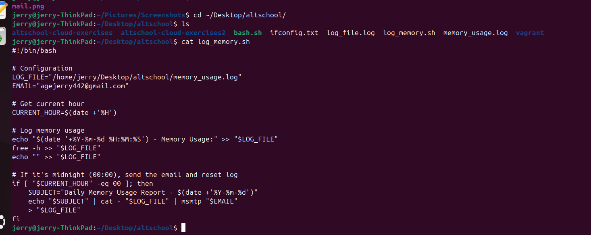
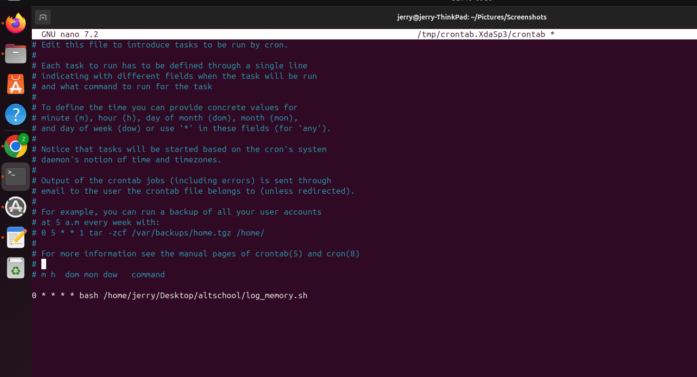

# Memory Usage Logger with Email Report

This project logs system memory (RAM) usage every hour and sends a daily summary email at midnight.

It includes:
- A Bash script to track memory usage

- A cronjob that triggers the script every hour

- Email delivery via `msmtp`

---
