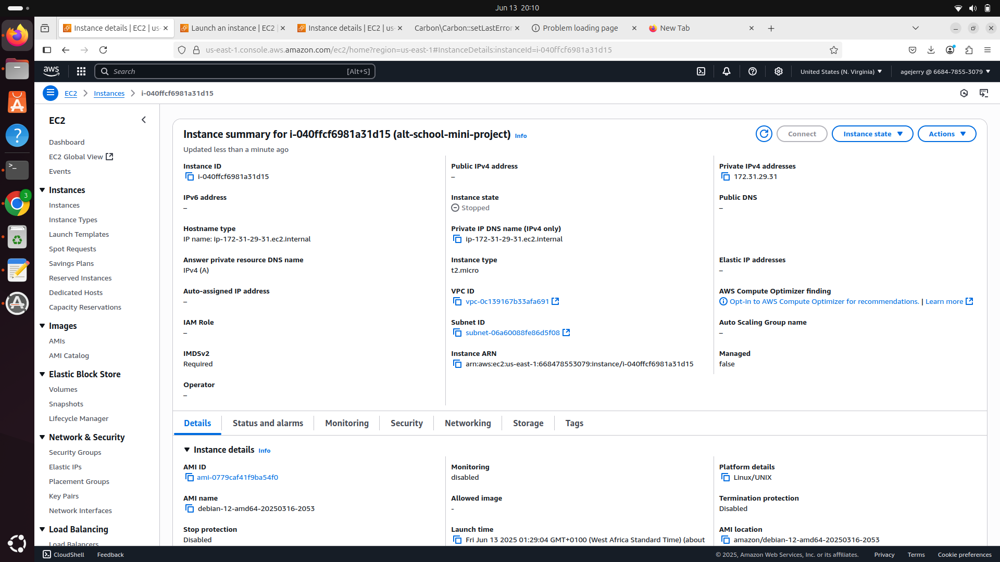
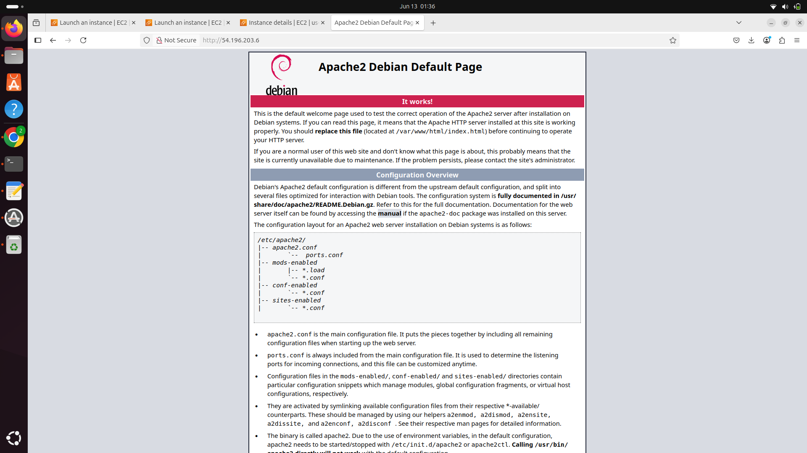
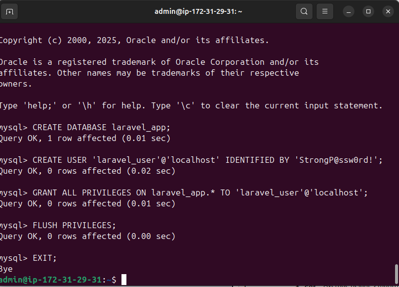
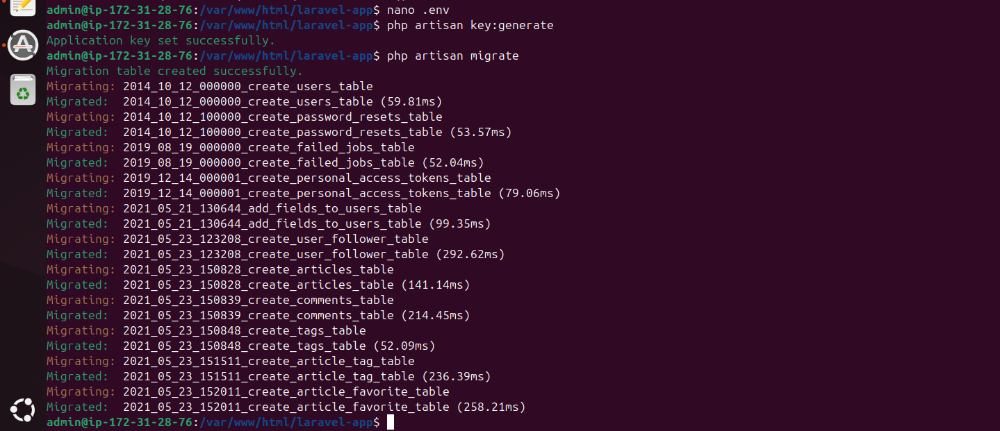
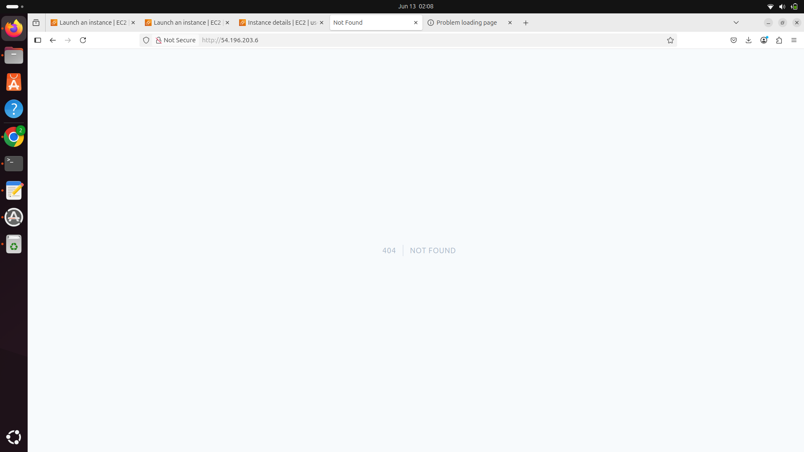
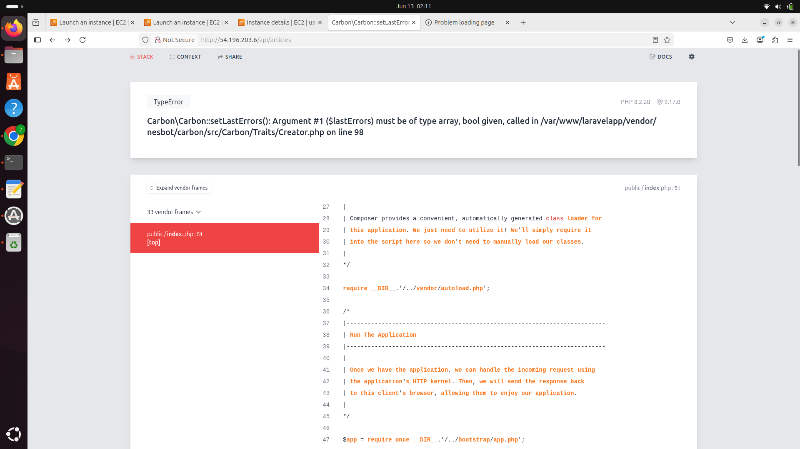

# Laravel Realworld App Deployment on Debian EC2

This guide documents the full setup and deployment of the [Laravel Realworld Example App](https://github.com/f1amy/laravel-realworld-example-app) on a Debian 11 EC2 instance using Apache and MySQL — without Docker or Sail.

---

## 0. EC2 Instance Setup

An EC2 instance was created on AWS with Debian 11, security group ports 22 (SSH), 80 (HTTP), and optionally 443 (HTTPS) open.



---

## 1. Apache Installation

Apache was installed and verified by visiting the server IP in a browser.

```bash
sudo apt update
sudo apt install apache2 -y
```

Apache's default welcome page confirms it’s running:



---

## 2. MySQL Installation & Setup

MySQL was manually installed and secured. A new database and user were created for Laravel:

```

Inside MySQL:

```sql
CREATE DATABASE laravel_app;
CREATE USER 'laravel_user'@'localhost' IDENTIFIED BY 'StrongP@ssw0rd!';
GRANT ALL PRIVILEGES ON laravel_app.* TO 'laravel_user'@'localhost';
FLUSH PRIVILEGES;
```



---

## 3. Laravel Project Setup

The Laravel Realworld Example App was cloned from GitHub and dependencies installed.

```bash
cd /var/www
sudo git clone https://github.com/f1amy/laravel-realworld-example-app laravelapp
cd laravelapp
composer install
cp .env.example .env
php artisan key:generate
php artisan migrate
```

This initializes the environment and creates tables in the database.



---

## 4. Apache Virtual Host Configuration

Apache was configured to serve Laravel from the `/public` directory:

```apache
<VirtualHost *:80>
    DocumentRoot /var/www/laravelapp/public

    <Directory /var/www/laravelapp/public>
        AllowOverride All
        Require all granted
    </Directory>

    ErrorLog ${APACHE_LOG_DIR}/laravelapp_error.log
    CustomLog ${APACHE_LOG_DIR}/laravelapp_access.log combined
</VirtualHost>
```

Then enabled and reloaded:

```bash
sudo a2dissite 000-default.conf
sudo a2ensite laravelapp.conf
sudo a2enmod rewrite
sudo systemctl reload apache2
```

---

## 5. Laravel Verification

Visiting the server IP now shows Laravel’s custom 404 page — proof that Laravel is installed and routing is active (though no root route is defined yet).



---

## 6. Laravel Application Errors

During use, Laravel displays certain internal errors. These are likely due to:

- Incomplete or invalid `.env` configuration
- Missing environment dependencies (e.g. queue, storage, keys)
- Permission issues

Further debugging is ongoing.



---


## Conclusion

This deployment avoids Docker and uses a bare-metal stack on a real Debian server to simulate production environments. While the Laravel API runs successfully, full functionality will require final error fixes and frontend integration.
