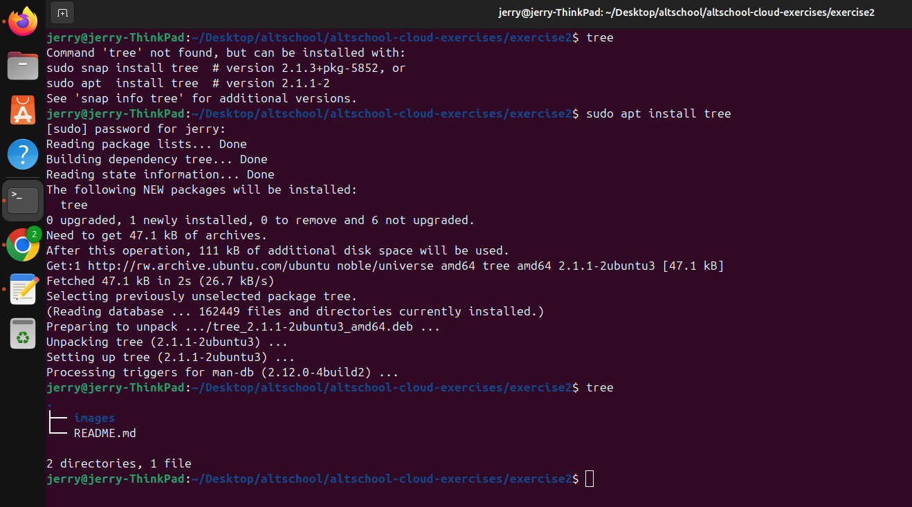
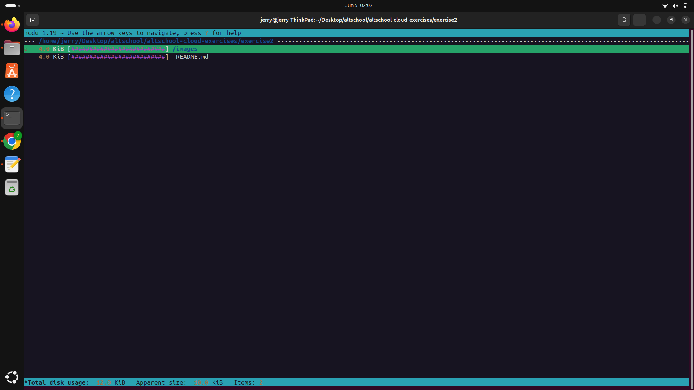
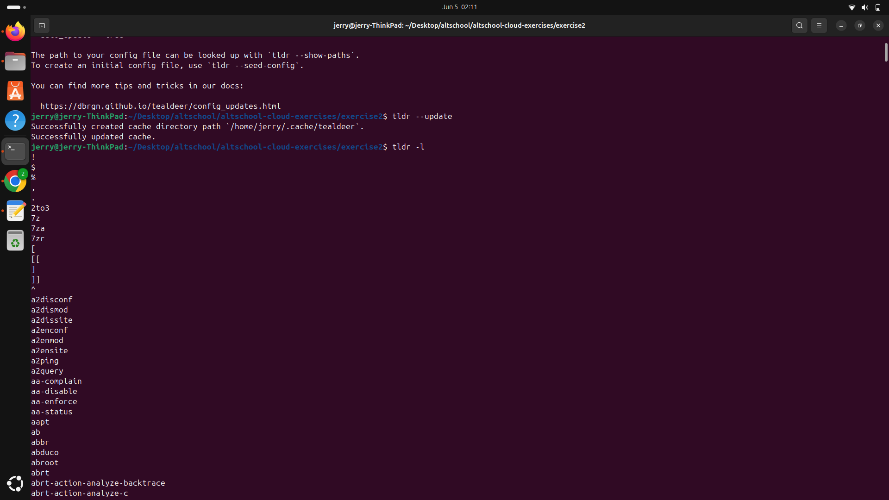
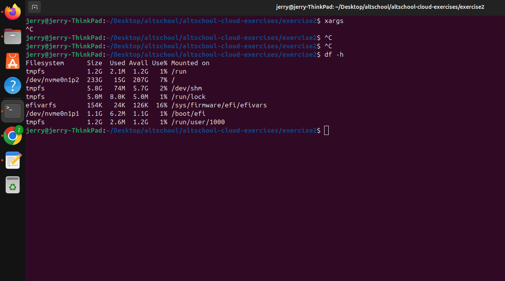
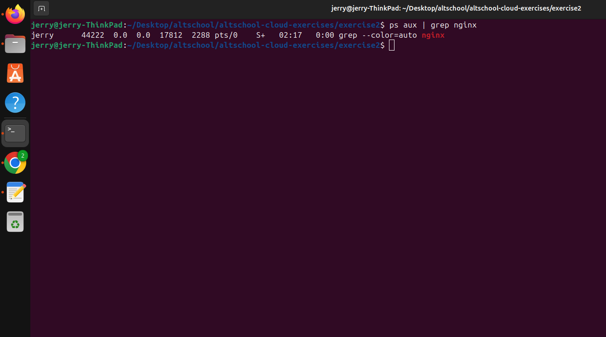
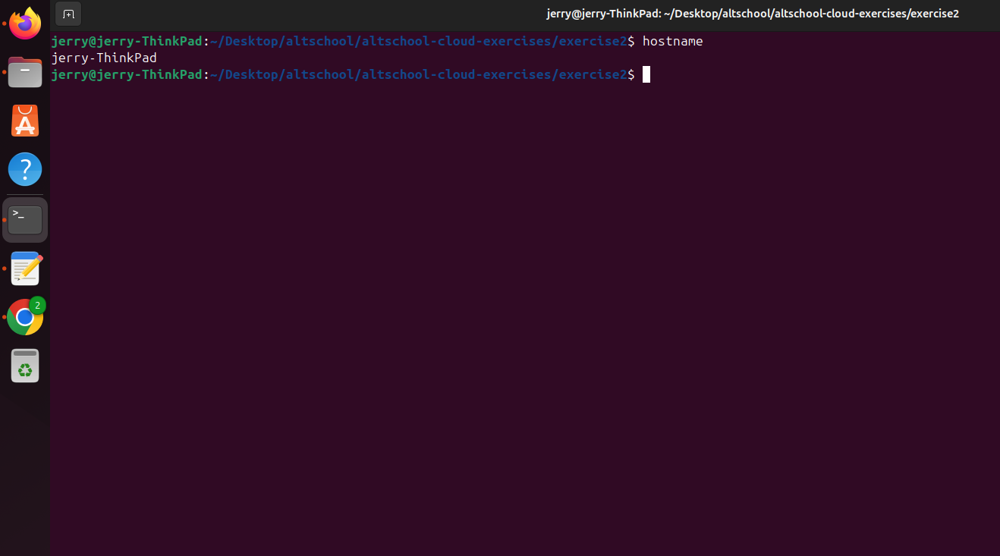

# Exercise 2: 10 Additional Linux Commands

List of Linux commands with usage examples and screenshots.

---

## 1. `tree`

**Description**: Displays directory contents in a tree-like format.

**Example**:
```bash
tree /etc
```

**Screenshot**:  


---

## 2. `ncdu`

**Description**: Disk usage analyzer with a text-based interface.

**Example**:
```bash
ncdu /
```

**Screenshot**:  


---

## 3. `tldr`

**Description**: Simplified and community-driven man pages.

**Example**:
```bash
tldr tar
```

**Screenshot**:  


---

## 4. `df`

**Description**: Reports disk space usage for file systems.

**Example**:
```bash
df -h
```

**Screenshot**:  


---

## 5. `ps`

**Description**: Displays running processes.

**Example**:
```bash
ps aux | grep nginx
```

**Screenshot**:  


---

## 6. `watch`

**Description**: Runs a command repeatedly and shows the output live.

**Example**:
```bash
watch -n 2 "df -h"
```

**Screenshot**:  


---

## 7. `ss`

**Description**: Displays detailed socket statistics.

**Example**:
```bash
ss -tuln
```

**Screenshot**:  


---

## 8. `htop`

**Description**: Interactive process viewer (an improved version of `top`).

**Example**:
```bash
htop
```

**Screenshot**:  


---

## 9. `hostname`

**Description**: Displays the system's hostname

**Example**:
```bash
hostname
```

**Screenshot**:  


---

## 10. `chage`

**Description**: Changes and views user password expiry settings.

**Example**:
```bash
sudo chage -l username
```

**Screenshot**:  


---

