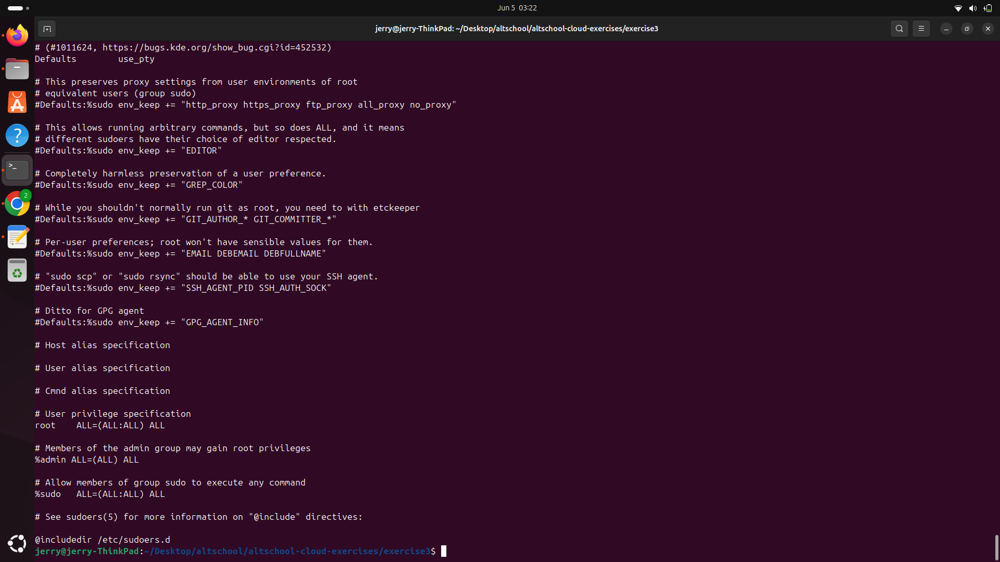
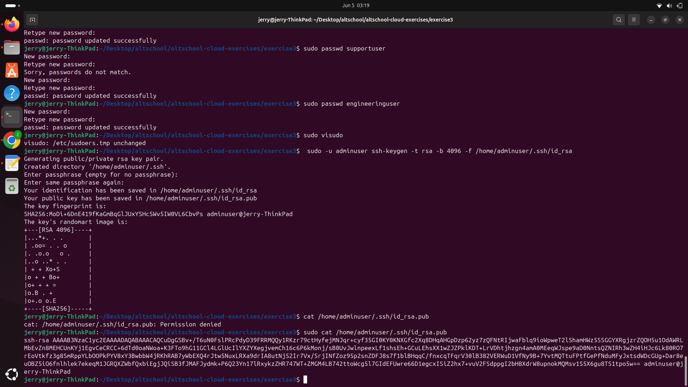

# Linux User and Group Configuration Exercise

This folder contains screenshots in PNG format as evidence of completing the following Linux system administration exercise:

---

##  Exercise Tasks

1. **Create three groups:**
   - `admin`
   - `support`
   - `engineering`

2. **Add the `admin` group to the sudoers list.**

3. **Create one user in each of the above groups:**
   - `adminuser` in `admin`
   - `supportuser` in `support`
   - `enguser` in `engineering`

4. **Generate SSH key pair for `adminuser`.**

---

##  Files Included

-   
 
  ➤ Screenshot of the `/etc/group` file showing the created groups and users.

-   

  ➤ Screenshot of the `/etc/passwd` file showing the users and their home directories.

-   
  ➤ Screenshot of the `/etc/sudoers` file confirming the `admin` group has sudo privileges.

-   
  ➤ Screenshot of the `SSH Generated` file confirming the `SSH key` generation

---

## Notes

- SSH keys were generated for `adminuser` using `ssh-keygen`.
- All commands were executed with appropriate privileges (via `sudo` where required).

---
