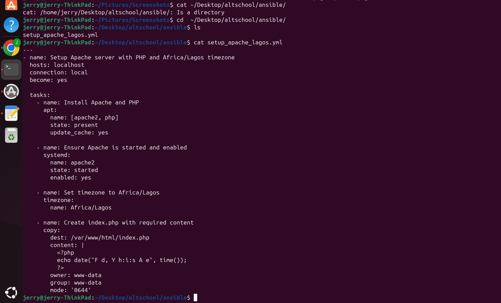
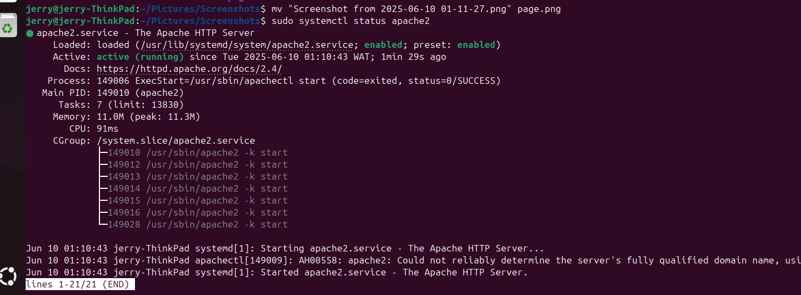

# Apache Setup via Ansible

This project uses an Ansible playbook to configure a local server with the following:

- Install Apache2
- Set the system timezone to `Africa/Lagos`
- Host a `index.php` file that displays the current date and time
- Ensure Apache is running properly

---

##  Ansible Playbook Summary

The playbook:
- Updates apt packages
- Installs Apache
- Sets system timezone to `Africa/Lagos`
- Deploys a PHP file to `/var/www/html/index.php`

---

##  Screenshots

### 1.  Ansible Playbook Run



---

### 2. Apache2 Status After Deployment



---

### 3.  Rendered PHP Page in Browser

The `index.php` file contains:

```php
<?php
echo date("F d, Y h:i:s A e", time());
?>
